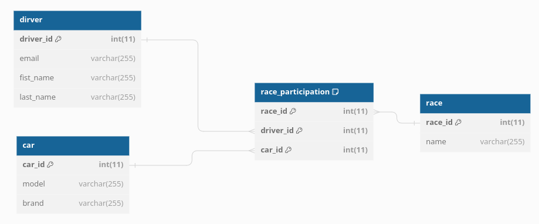

# ESGI - GRPC Project
> Car racing manager
## Groupes
- Léo STEVENOT
- Nathan PONCET
- Mohamed BENALIA
- Bastien BREVET
## Docker services
- Mysql
- Car API
- Race API
- Driver API
## Installation
### APIs
#### Car API
>[Car API Installation](api/car-api/readme.md)
#### Race API
>[Race API Installation](api/race-api/readme.md)
#### driver API
>[Driver API Installation](api/driver-api/readme.md)
### App
#### Env vars
```shell
# Set env vars
cp .env.example .env
```
#### Stubs
```shell
# Install stubs
cd protos
npm install -g @bufbuild/buf  
sh export.sh
```
#### Certs
```shell
# Install certificates
cd certs
mkcert -install

## Car API
mkcert car-api localhost
mv car-api+1.pem car-api.pem
mv car-api+1-key.pem car-api-key.pem

## Race API
mkcert race-api localhost
mv race-api+1.pem race-api.pem
mv race-api+1-key.pem race-api-key.pem

## Driver API
mkcert driver-api localhost
mv driver-api+1.pem driver-api.pem
mv driver-api+1-key.pem driver-api-key.pem
```
#### Docker
```shell
# Install services
sudo docker-compose up -d 
```
## MLD


